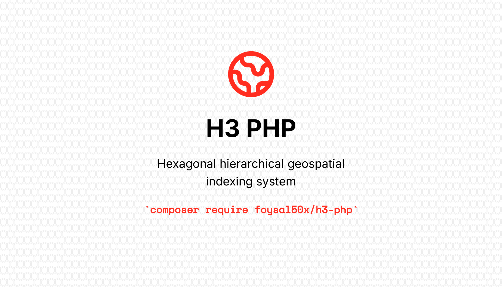

<p align="center">
  
  <a href="https://github.com/Foysal50x/h3-php/actions/"></a>
  <a href="https://github.com/Foysal50x/h3-php/actions/"></a>
  <a href="https://packagist.org/packages/foysal50x/h3-php"></a>
</p>

# H3 PHP FFI Bindings

PHP FFI bindings for [Uber's H3](https://h3geo.org/) hexagonal hierarchical geospatial indexing system.

Based on **H3 v4.4.1** - the latest version as of November 2025.

## Requirements

- PHP 8.1 or higher
- PHP FFI extension enabled (`ffi.enable=1` in php.ini)

## Installation

### 1. Enable PHP FFI Extension

The FFI extension must be enabled in your `php.ini`:

```ini
; Enable the FFI extension
extension=ffi

; Enable FFI for all scripts (required for this library)
ffi.enable=true
```

**Note:** `ffi.enable` can be set to:
- `true` or `1` - Enable FFI for all scripts (recommended for development)
- `preload` - Enable FFI only in preloaded scripts (recommended for production)

To verify FFI is enabled:
```bash
php -m | grep FFI
php -i | grep ffi.enable
```

### 2. Install the PHP Package

```bash
composer require foysal50x/h3
```

This package includes **pre-built H3 libraries** for common platforms:
- macOS (Apple Silicon & Intel)
- Linux (x64 & ARM64)
- Windows (x64)

The library will automatically detect and use the appropriate bundled binary.

### 3. (Optional) System H3 Library

If the bundled library doesn't work for your platform, you can install the H3 C library system-wide:

**macOS (Homebrew):**
```bash
brew install h3
```

**Ubuntu/Debian:**
```bash
sudo apt install libh3-dev
```

**From source:**
```bash
git clone https://github.com/uber/h3.git
cd h3
cmake -B build
cmake --build build
sudo cmake --install build
```

## Quick Start

```php
<?php

use Foysal50x\H3\H3;

$h3 = new H3();

// Convert coordinates to H3 cell
$cell = $h3->latLngToCell(37.7749, -122.4194, 9);
echo "H3 Index: " . $h3->h3ToString($cell) . "\n";

// Get cell center coordinates
$coords = $h3->cellToLatLng($cell);
echo "Center: {$coords['lat']}, {$coords['lng']}\n";

// Get neighboring cells
$neighbors = $h3->gridDisk($cell, 1);
echo "Neighbors: " . count($neighbors) . "\n";
```

## API Reference

### Indexing Functions

```php
// Convert lat/lng to H3 cell
$cell = $h3->latLngToCell(float $lat, float $lng, int $resolution): int

// Convert H3 cell to lat/lng center
$coords = $h3->cellToLatLng(int $cell): array{lat: float, lng: float}

// Get cell boundary vertices
$boundary = $h3->cellToBoundary(int $cell): array
```

### Inspection Functions

```php
$h3->getResolution(int $cell): int
$h3->getBaseCellNumber(int $cell): int
$h3->h3ToString(int $cell): string
$h3->stringToH3(string $str): int
$h3->isValidCell(int $cell): bool
$h3->isResClassIII(int $cell): bool
$h3->isPentagon(int $cell): bool
```

### Traversal Functions

```php
// Get all cells within k distance (filled disk)
$cells = $h3->gridDisk(int $origin, int $k): array

// Get cells with their distances
$results = $h3->gridDiskDistances(int $origin, int $k): array

// Get cells in a hollow ring at exactly k distance
$cells = $h3->gridRing(int $origin, int $k): array

// Get grid distance between two cells
$distance = $h3->gridDistance(int $origin, int $destination): int

// Get path between two cells
$path = $h3->gridPathCells(int $start, int $end): array
```

### Hierarchy Functions

```php
// Get parent cell at coarser resolution
$parent = $h3->cellToParent(int $cell, int $parentRes): int

// Get all children at finer resolution
$children = $h3->cellToChildren(int $cell, int $childRes): array

// Get center child at finer resolution
$child = $h3->cellToCenterChild(int $cell, int $childRes): int

// Compact cells to minimal representation
$compacted = $h3->compactCells(array $cells): array

// Uncompact cells to specific resolution
$cells = $h3->uncompactCells(array $cells, int $res): array
```

### Directed Edge Functions

```php
$h3->areNeighborCells(int $origin, int $destination): bool
$h3->cellsToDirectedEdge(int $origin, int $destination): int
$h3->isValidDirectedEdge(int $edge): bool
$h3->getDirectedEdgeOrigin(int $edge): int
$h3->getDirectedEdgeDestination(int $edge): int
$h3->directedEdgeToCells(int $edge): array{origin: int, destination: int}
$h3->originToDirectedEdges(int $origin): array
$h3->directedEdgeToBoundary(int $edge): array
```

### Vertex Functions

```php
$h3->cellToVertex(int $cell, int $vertexNum): int
$h3->cellToVertexes(int $cell): array
$h3->vertexToLatLng(int $vertex): array{lat: float, lng: float}
$h3->isValidVertex(int $vertex): bool
```

### Measurement Functions

```php
// Average hexagon area at resolution
$h3->getHexagonAreaAvgKm2(int $res): float
$h3->getHexagonAreaAvgM2(int $res): float

// Exact cell area
$h3->cellAreaKm2(int $cell): float
$h3->cellAreaM2(int $cell): float
$h3->cellAreaRads2(int $cell): float

// Average edge length at resolution
$h3->getHexagonEdgeLengthAvgKm(int $res): float
$h3->getHexagonEdgeLengthAvgM(int $res): float

// Exact edge length
$h3->edgeLengthKm(int $edge): float
$h3->edgeLengthM(int $edge): float
$h3->edgeLengthRads(int $edge): float

// Great circle distance between coordinates
$h3->greatCircleDistanceKm(float $lat1, float $lng1, float $lat2, float $lng2): float
$h3->greatCircleDistanceM(float $lat1, float $lng1, float $lat2, float $lng2): float
```

### Utility Functions

```php
$h3->getNumCells(int $res): int
$h3->getRes0Cells(): array
$h3->getPentagons(int $res): array
$h3->degsToRads(float $degrees): float
$h3->radsToDegs(float $radians): float
```

### Local IJ Coordinates

```php
$h3->cellToLocalIj(int $origin, int $cell, int $mode = 0): array{i: int, j: int}
$h3->localIjToCell(int $origin, int $i, int $j, int $mode = 0): int
```

## Error Handling

All methods that can fail will throw an `H3Exception`:

```php
use Foysal50x\H3\H3;
use Foysal50x\H3\H3Exception;

try {
    $h3 = new H3();
    $cell = $h3->latLngToCell(37.7749, -122.4194, 20); // Invalid resolution
} catch (H3Exception $e) {
    echo "Error: " . $e->getMessage() . "\n";
    echo "H3 Error Code: " . $e->getH3ErrorCode() . "\n";

    if ($e->isInvalidResolution()) {
        echo "Resolution must be between 0 and 15\n";
    }
}
```

### Common Exceptions

The library will throw `H3Exception` in these cases:

1. **FFI Extension Not Loaded**
   ```
   The FFI extension is not loaded. Please enable it in your php.ini by adding "extension=ffi".
   ```

2. **FFI Not Enabled**
   ```
   FFI is not enabled. Please set "ffi.enable=true" or "ffi.enable=preload" in your php.ini.
   ```

3. **H3 Library Not Found**
   ```
   Could not find H3 library. Please install H3 or provide the library path.
   ```

## Custom Library Path

If the H3 library is not in a standard location:

```php
$h3 = new H3('/custom/path/to/libh3.so');
```

## Singleton Pattern

For convenience, you can use the singleton pattern:

```php
$h3 = H3::getInstance();
// ... use $h3 ...

// Reset if needed
H3::resetInstance();
```

## Resolution Guide

| Resolution | Avg Hex Area | Avg Edge Length |
|------------|--------------|-----------------|
| 0 | 4,357,449.416 km² | 1,281.256 km |
| 1 | 609,788.441 km² | 483.057 km |
| 2 | 86,801.780 km² | 182.512 km |
| 3 | 12,393.434 km² | 68.979 km |
| 4 | 1,770.347 km² | 26.071 km |
| 5 | 252.903 km² | 9.854 km |
| 6 | 36.129 km² | 3.724 km |
| 7 | 5.161 km² | 1.406 km |
| 8 | 0.737 km² | 531.414 m |
| 9 | 0.105 km² | 200.786 m |
| 10 | 0.015 km² | 75.863 m |
| 11 | 0.002 km² | 28.663 m |
| 12 | 307.092 m² | 10.830 m |
| 13 | 43.870 m² | 4.092 m |
| 14 | 6.267 m² | 1.546 m |
| 15 | 0.895 m² | 0.584 m |

## Running Tests

```bash
composer install
composer test
```

## License

MIT License - see [LICENSE](LICENSE) file.

## Links

- [H3 Documentation](https://h3geo.org/)
- [H3 GitHub Repository](https://github.com/uber/h3)
- [H3 API Reference](https://h3geo.org/docs/api/indexing)
